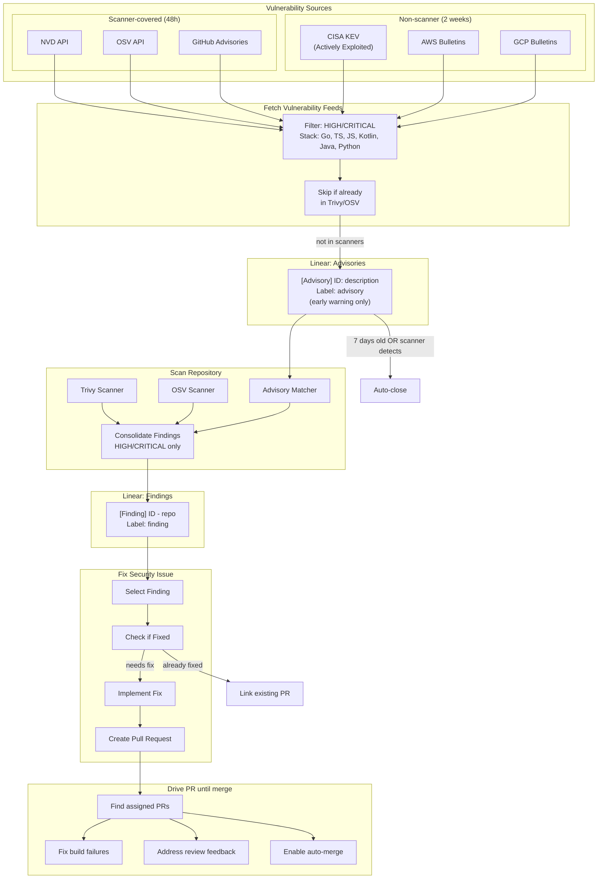

# Your Ona AI Security Engineer

A 100% autonomous AI engineer who monitors for CVEs and other vulnerabilities and drives fixes.

## Data Flow

## Automations

| Automation | Trigger | Input | Output |
|------------|---------|-------|--------|
| `Fetch Vulnerability Feeds` | Manual/Scheduled | NVD, OSV, GitHub (48h), CISA KEV, AWS, GCP (2 weeks) | Advisory issues for vulns not yet in scanners |
| `Scan Repository` | Manual | Repository code + Advisories | Finding issues (label: `finding`) |
| `Fix Security Issue` | Manual | Finding issues | Pull requests |
| `Drive PR until merge` | Manual | Open PRs assigned to user | Merged PRs |

## Vulnerability Sources

| Source | Scanner Coverage | Time Window | Purpose |
|--------|-----------------|-------------|---------|
| NVD API | Trivy, OSV | 48 hours | Early warning before scanner DB update |
| OSV API | OSV-Scanner | 48 hours | Early warning before scanner DB update |
| GitHub Advisories | Trivy, OSV | 48 hours | Early warning before scanner DB update |
| CISA KEV | None | 2 weeks | Actively exploited vulnerabilities |
| AWS Bulletins | None | 2 weeks | Cloud-specific issues |
| GCP Bulletins | None | 2 weeks | Cloud-specific issues |

## Linear Issue Types

**Advisories** (`[Advisory]` prefix, `advisory` label)
- Early warning for vulnerabilities not yet in scanner databases
- Only created if: affects our stack AND not in Trivy/OSV
- Includes "Why This Was Flagged" reason
- Supports multiple ID types: CVE, GHSA, or vendor-specific
- Auto-closed when scanners add coverage or after 7 days

**Findings** (`[Finding]` prefix, `finding` label)
- Confirmed vulnerability in a specific repository
- Created by Trivy/OSV scanner or advisory match
- Contains exact file locations and versions
- Supports advisory IDs: CVE, GHSA, or vendor-specific

## Tech Stack Coverage

- **Languages:** Go, TypeScript, JavaScript, Kotlin, Java, Python
- **Cloud:** AWS, GCP
- **Scanners:** Trivy (filesystem), OSV-Scanner (dependencies)
