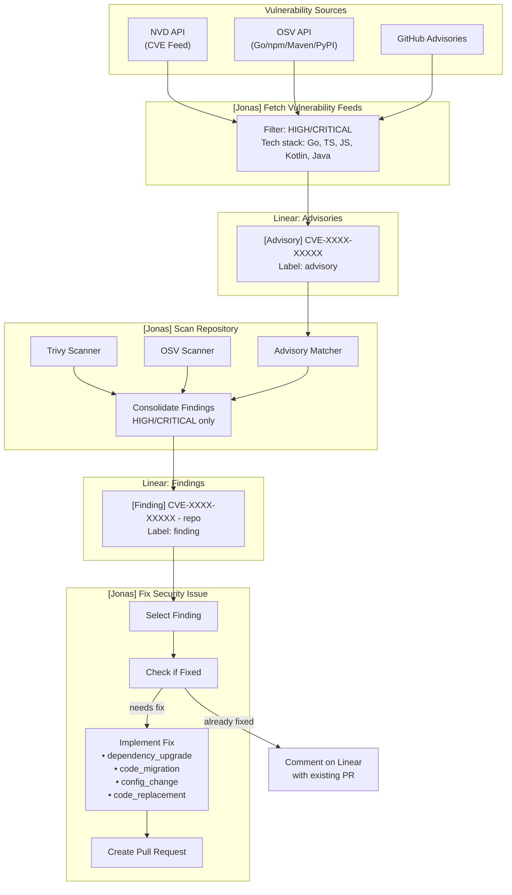

# Jonas, your Ona AI Security Engineer

Jonas is a 100% autonomous AI engineer who monitors for CVEs and other vulnerabilities and drives fixes.

## Data Flow

## Automations

| Automation | Trigger | Input | Output |
|------------|---------|-------|--------|
| `[Jonas] Fetch Vulnerability Feeds` | Manual/Scheduled | NVD, OSV, GitHub APIs | Advisory issues (label: `advisory`) |
| `[Jonas] Scan Repository` | Manual | Repository code + Advisories | Finding issues (label: `finding`) |
| `[Jonas] Fix Security Issue` | Manual | Finding issues | Pull requests |

## Linear Issue Types

**Advisories** (`[Advisory]` prefix, `advisory` label)
- General vulnerability awareness from public feeds
- Not repository-specific
- Contains detection guidance for engineers

**Findings** (`[Finding]` prefix, `finding` label)
- Confirmed vulnerability in a specific repository
- Created by scanner or advisory match
- Contains exact file locations and versions