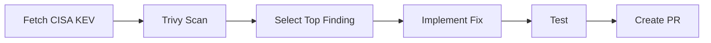

# Security Fix Pipeline Demo

Automated vulnerability detection and remediation: fetch threat intel, scan, fix, and ship.

**Steps:**
1. **Fetch** - CISA Known Exploited Vulnerabilities (not in scanners)
2. **Scan** - Trivy finds HIGH/CRITICAL issues
3. **Select** - Prioritize: KEV > CRITICAL > HIGH > oldest
4. **Fix** - Update dependency, adapt code if needed
5. **Test** - Build, run tests, verify CVE resolved
6. **PR** - Submit fix for review
